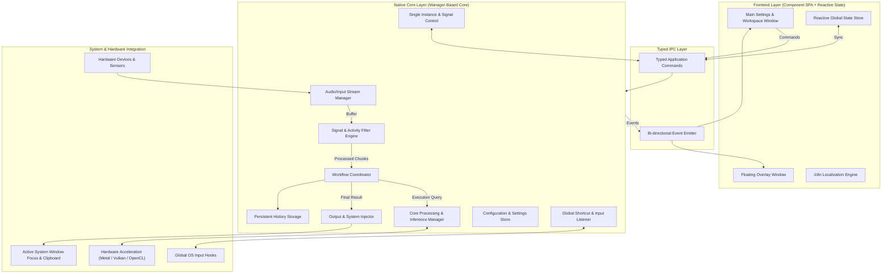
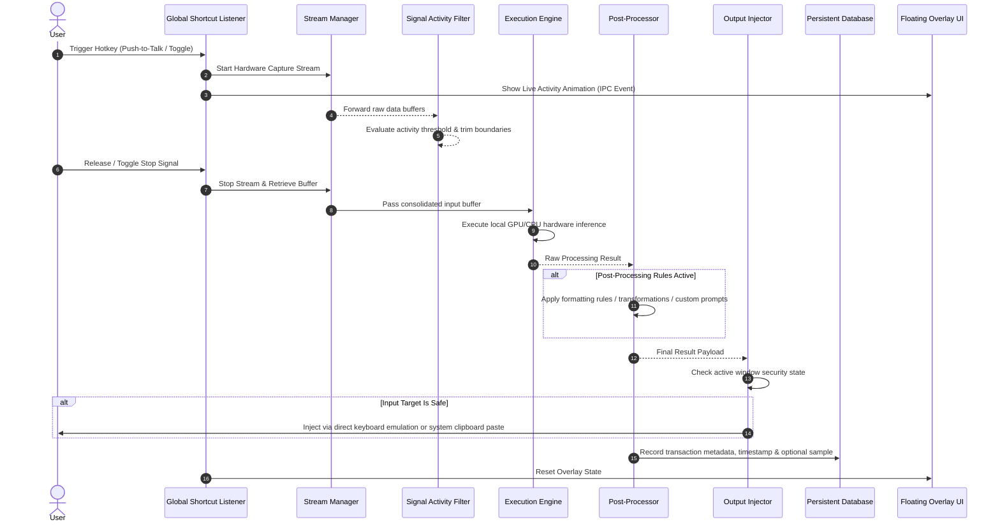
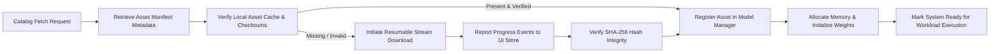

# Universal Application Architecture & Design System Specification (Design.md)

## 1. Executive Summary & Design Philosophy

This document defines a reusable, local-first, low-latency desktop application architecture and design system specification. It provides a blueprint for building high-performance cross-platform software featuring typed IPC communication, local hardware-accelerated processing, zero-friction background operations, and a premium visual user interface.

### Key Architectural & Design Pillars
- **Local-First & Privacy by Design**: Core workloads execute on-device without external cloud dependencies, ensuring user data privacy, low latency, and offline resilience.
- **Sub-Second Performance Pipeline**: Optimized stream processing using native system APIs, hardware GPU acceleration, and direct system integration.
- **Zero-Friction User Experience**: Silent background operation with non-intrusive floating overlays, global hotkey hooks (push-to-talk and toggle modes), and system tray integration.
- **Cross-Platform Parity**: Universal feature parity across operating systems (macOS, Windows, Linux) leveraging native hardware acceleration and OS-level window management abstractions.
- **Modular Component Architecture**: Decoupled, manager-based backend paired with a reactive component-driven frontend interface.

---

## 2. Universal Architecture Topology

The application utilizes a **Command-Event, Manager-Based Architecture**. High-performance operations (device capture, stream processing, local model inference, database storage, system hooks) reside in a compiled native core, while the presentation layer handles workspace settings, UI state, and interactive controls over a strongly typed IPC boundary.



---

## 3. Layered Component Architecture

### 3.1 Native Core Layer Structure

The core engine is organized into single-responsibility **Managers** maintained in global application state:

```
native-core/
├── entrypoint                  # Main initialization & plugin setup
├── cli                         # Command-line parameter parsing & signal overrides
├── signal_handler              # Cross-process signal relay & remote command control
├── settings                    # Persistent state configuration definitions & defaults
├── overlay_manager             # OS-native floating transparent window level controller
├── tray_manager                # System tray icon, context menu, and dynamic localization
├── output_injector             # Cross-platform input simulation & clipboard manager
├── input_security              # Secure input field detection & privacy masking
├── shortcut_listener           # Global hotkey thread & key sequence processing
├── dynamic_integrations        # Optional external API & post-processing client integrations
├── sound_feedback             # System audio feedback & sound cue generator
├── managers/
│   ├── stream_manager          # Hardware stream lifecycle & device enumeration
│   ├── model_manager           # Asset downloading, hash validation & memory loading
│   ├── capability_matrix       # Hardware feature detection & runtime ISA scoring
│   ├── core_processor          # Workload execution & engine dispatch
│   └── history_store           # Database operations & dynamic migrations
├── stream_toolkit/
│   ├── device_io               # Device stream buffers, ring buffers & resamplers
│   └── activity_detector       # Real-time signal activity filtering
└── catalog/                    # Asset repository definitions & download manifests
```

#### Native Core Domain Responsibilities

| Subsystem / Manager | Core Responsibilities | Architectural Goals |
| :--- | :--- | :--- |
| **Stream Manager** | Enumerates hardware devices, manages active stream lifetimes, handles hot-swapping and device fallbacks. | Zero sample loss, low latency, automatic audio/device recovery. |
| **Activity Detector** | Evaluates real-time sample buffers against activity thresholds to strip silence and noise. | Minimizes CPU/GPU compute overhead by pruning non-actionable input. |
| **Model / Execution Manager**| Handles asset downloads, integrity verification, memory allocation, and hardware acceleration dispatch. | Safe memory allocation, automatic GPU fallback, zero runtime panics. |
| **Workflow Coordinator** | Orchestrates end-to-end data flow: Input capture → Noise filtering → Processing → Post-processing → Output. | Sequential stream safety, asynchronous non-blocking execution. |
| **Output Injector** | Injects processed results into active focus targets via simulated keypresses or system clipboard. | Universal application compatibility, clipboard restoration. |
| **History Storage** | Maintains transactional history logs, retention policies, and search indices via an embedded database. | Fast indexing, automatic retention purging, zero data corruption. |
| **Shortcut Listener** | Listens for global OS keystrokes asynchronously (Push-to-Talk and Toggle modes). | Low key-latency, hotkey conflict prevention, global OS access. |

---

### 3.2 Presentation & Frontend UI Layer Structure

The presentation layer is built as a single-page reactive application with zero unstyled states.

```
frontend/
├── main                        # Application entry point
├── App                         # Navigation router, onboarding, and workspace shell
├── overlay/                    # Mini floating overlay window entry & view component
├── type_bindings               # Auto-generated IPC type bindings matching native core
├── stores/
│   └── applicationStore        # Reactive state store synchronized with backend persistence
├── hooks/
│   ├── useSettings             # Reactive settings sync hook
│   └── useHardwareDevices      # Active device enumeration hook
├── components/
│   ├── settings/               # Workspace settings tabs (General, Hotkeys, Hardware, Models, Advanced)
│   ├── asset-manager/          # Model/asset download & management interface
│   ├── onboarding/             # Interactive first-run setup wizard
│   ├── updates/                # Software update notification dialog
│   ├── announcements/          # Release notes & what's new modal
│   └── ui/ & shared/           # Atomic UI elements (Buttons, Cards, Sliders, Modals)
└── i18n/                       # Multi-language dictionary files & localization setup
```

---

## 4. Design System & Visual Aesthetics

### 4.1 Aesthetic Principles
- **Modern Dark & Light Themes**: Carefully selected HSL color tokens for high contrast, legibility, and reduced eye strain.
- **Glassmorphism & Depth**: Subtle backdrop blurs, soft border highlights, and layered elevations to distinguish control panels from content.
- **Micro-Animations**: Smooth visual feedback on button interactions, toggles, state transitions, and live activity visualizers.
- **Typography**: Clean, highly legible sans-serif font stack with clear hierarchical scaling (Headers, Body, Captions, Monospace data views).
- **Responsive Workspace**: Flexible grid layouts designed for scalable window dimensions, collapsible sidebars, and tabbed settings panels.

### 4.2 UI Design System Token Matrix

```css
:root {
  /* Color Palette - Neutral Surface Tokens */
  --bg-primary: HSL(220, 15%, 10%);
  --bg-secondary: HSL(220, 15%, 14%);
  --bg-tertiary: HSL(220, 15%, 18%);
  --surface-border: HSL(220, 10%, 25%);

  /* Accent & State Tokens */
  --accent-primary: HSL(215, 90%, 60%);
  --accent-hover: HSL(215, 95%, 65%);
  --accent-active: HSL(215, 85%, 55%);

  --status-success: HSL(145, 65%, 45%);
  --status-warning: HSL(38, 92%, 50%);
  --status-danger: HSL(355, 78%, 56%);

  /* Text Contrast Tokens */
  --text-main: HSL(220, 20%, 95%);
  --text-muted: HSL(220, 10%, 65%);
  --text-subtle: HSL(220, 10%, 45%);

  /* Radius & Shadows */
  --radius-sm: 6px;
  --radius-md: 10px;
  --radius-lg: 16px;
  --shadow-elevation: 0 10px 30px -10px rgba(0, 0, 0, 0.5);
  --glass-backdrop: blur(12px) saturate(180%);
}
```

---

## 5. System Data Flow Pipelines

### 5.1 Main Processing & Output Injection Pipeline



---

### 5.2 Asset Download & Management Flow



---

## 6. Security, Privacy & System Integration Controls

### 6.1 Privacy & Data Isolation Standards
1. **100% On-Device Processing**: All sensitive inputs remain strictly inside volatile local memory or encrypted local storage. Zero network telemetry or data sampling without explicit user opt-in.
2. **Secure Input Field Masking**: The core monitors system window focus states. If a focused field is identified as a secure password input, result auto-injection is suppressed to prevent credential leaks.
3. **Configurable Data Retention**: Embedded database implements automated retention filters allowing users to specify history retention windows (e.g., 24 hours, 7 days, 30 days, or volatile memory-only mode).

### 6.2 Single-Instance Architecture & CLI Controls
- Enforces single-instance binary execution.
- Launching subsequent process instances passes command flags (e.g., `--toggle-execution`, `--cancel`, `--start-hidden`) over local IPC sockets to the primary instance, then immediately terminates.
- Prevents resource contention over hardware devices and system hooks.

---

## 7. Internationalization (i18n) Framework

- **Single Source Translation Dictionary**: Locale strings organized in structured JSON files (`locales/en/translation.json`).
- **JSX Enforcement**: All user-facing strings are rendered via localization hooks (`useTranslation()`). Hardcoded UI strings are forbidden in code reviews.
- **Dynamic Language Switching**: Reactively updates presentation components and system tray menus at runtime without requiring app restarts.

---

## 8. Testing & Quality Assurance Plan

### 8.1 Automated Testing Strategy
- **End-to-End UI Testing**: Automated integration suites for user flows, onboarding, and settings panels.
- **Translation Validation**: Automated scripts verifying key coverage across all target locales against the primary source catalog.
- **Static Analysis & Formatting**: Enforced linting and code formatting checks across frontend and native codebases prior to deployment.

### 8.2 System Verification Checklist
- **Hardware Device Fallbacks**: Validate audio/input stream continuity when switching hardware devices or disconnecting default peripherals.
- **Low-Latency Benchmark**: Ensure end-to-end processing latency remains under defined targets across target hardware tiers.
- **Platform Parity**: Verify global shortcut listeners, system tray controls, and overlay floating windows on macOS, Windows, and Linux.
