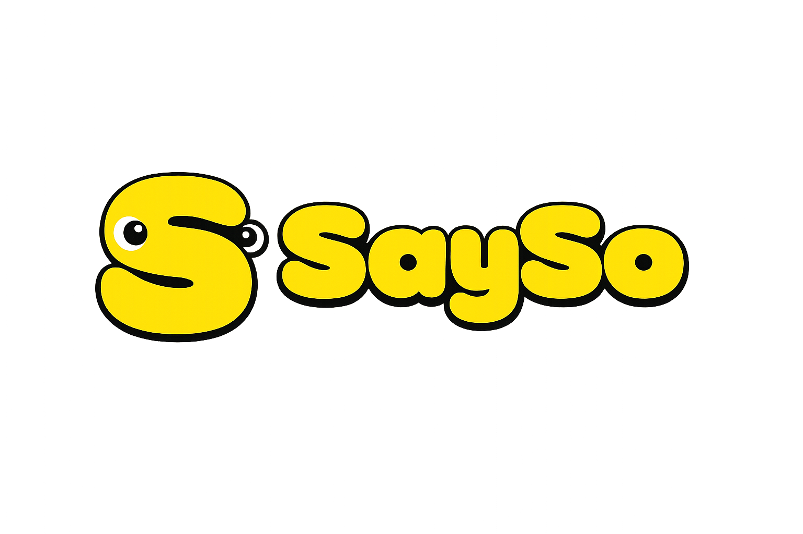
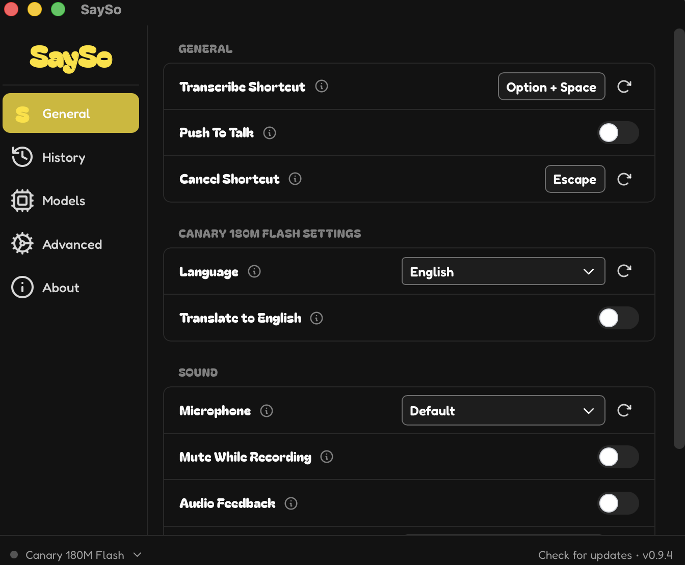
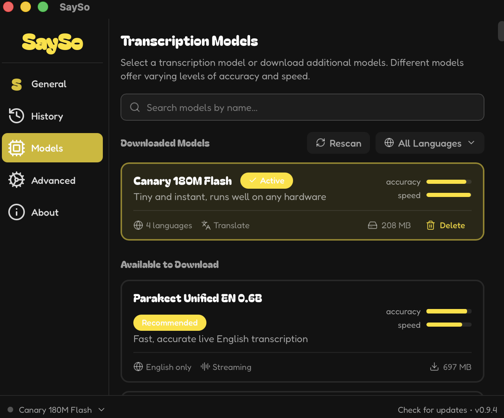
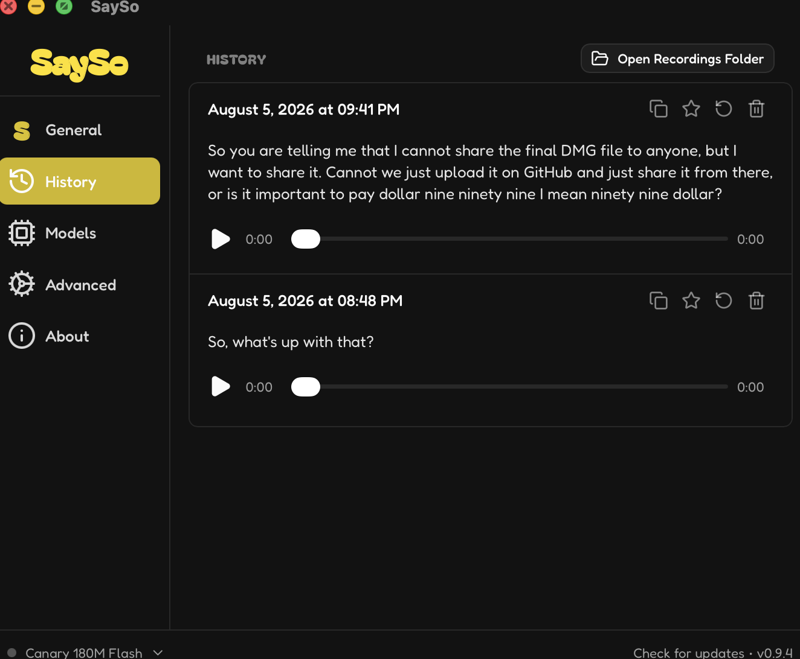
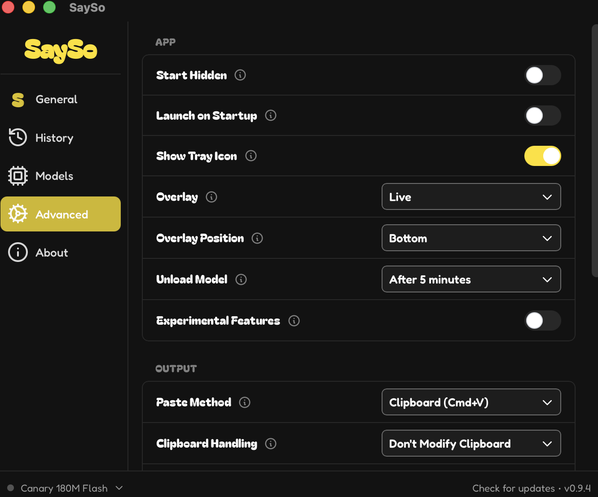
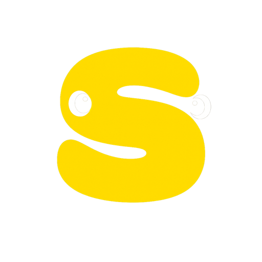
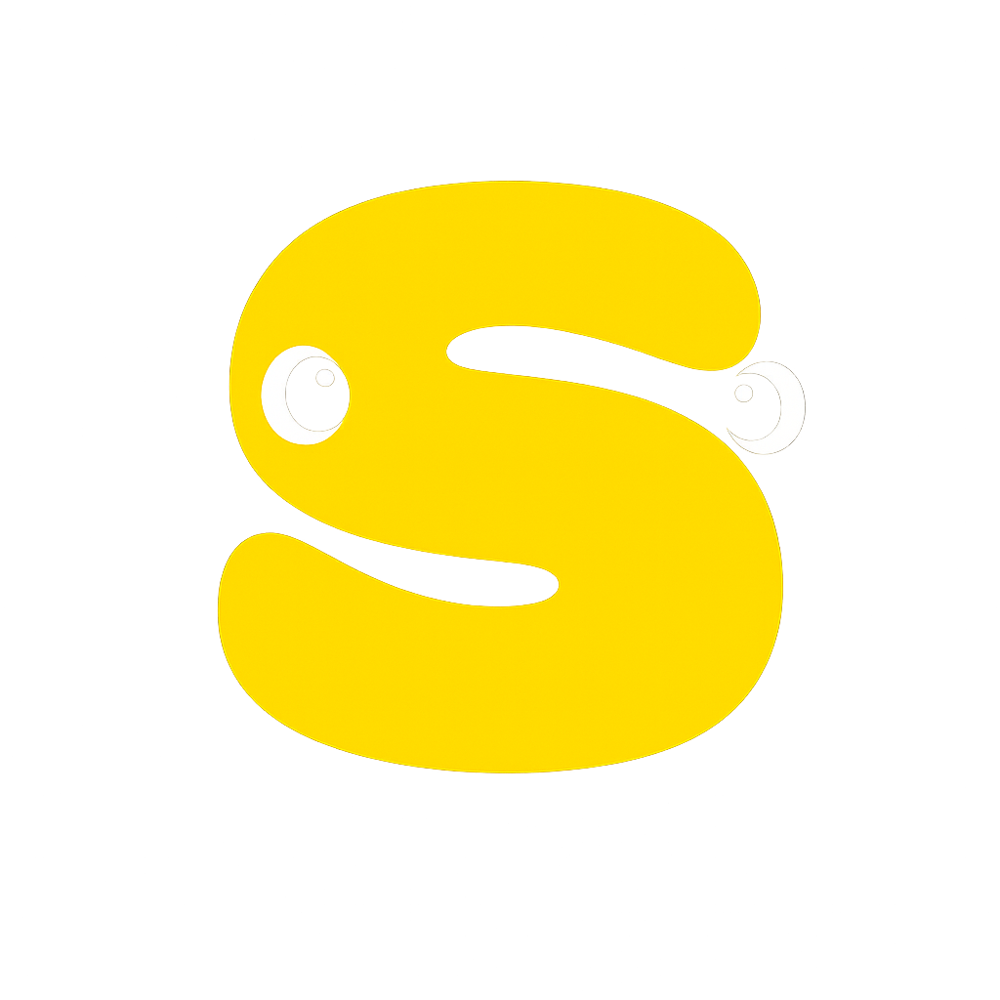

<p align="center">
  
</p>

<p align="center">
  <b>Speak into any text field.</b><br>
  Free, unlimited, open source speech-to-text that runs entirely on your machine.
</p>

<p align="center">
  
  
  
  
</p>

<p align="center">
  <a href="https://github.com/AaryanRaj007/sayso-website/raw/main/public/SaySo_0.9.4_aarch64.dmg"><b>Download for macOS</b></a>
  ·
  <a href="#install">Install</a>
  ·
  <a href="#build-from-source">Build</a>
</p>

---

Press <kbd>Option</kbd> + <kbd>Space</kbd>, talk, let go. Your words land wherever
the cursor was. No account, no subscription, no audio leaving your computer.

<p align="center">
  
  
</p>
<p align="center">
  
  
</p>

## Why

|  |  |
| :-- | :-- |
| **Offline** | Transcription runs locally. Your voice never touches a server. |
| **Free** | No subscription, no usage caps, no account. |
| **Fast** | GPU accelerated. Short clips transcribe faster than real time. |
| **67 models** | Whisper, Parakeet, Canary, Moonshine, and more. Pick per machine. |
| **Yours** | MIT licensed. Fork it, break it, make it what you need. |

## Install

**Homebrew** — no security warning:

```bash
brew install --cask --no-quarantine AaryanRaj007/sayso/sayso
```

**Or download the `.dmg`** and drag SaySo to Applications. macOS will say it
can't verify the app, because it isn't notarized by Apple. Open
**System Settings → Privacy & Security**, scroll down, click **Open Anyway**.

> Install to `/Applications`. Running SaySo from the mounted disk image means
> macOS can never remember its Accessibility permission.

On first launch, grant **Microphone** (to hear you) and **Accessibility** (to
type for you). Then hit <kbd>Option</kbd> + <kbd>Space</kbd>.

## Build from source

Needs [Rust](https://rustup.rs) and [Bun](https://bun.sh).

```bash
git clone https://github.com/AaryanRaj007/SaySo.git
cd SaySo
bun install
bun run tauri build
```

Installing your own build:

```bash
./scripts/create-signing-identity.sh   # once per machine
./scripts/install-macos.sh             # installs to /Applications, signs, launches
```

The signing identity matters. Ad-hoc signing changes the app's hash on every
build, which silently invalidates the Accessibility permission and leaves the
System Settings toggle switched on while the app sees it as off. Signing with a
stable certificate keeps the grant across rebuilds.

## How it works

```
shortcut → record → VAD trims silence → local model → paste at cursor
```

Tauri 2 (Rust) with a React + TypeScript frontend. Whisper-family models run
through `transcribe-cpp` (GGML/GGUF, Metal accelerated); Parakeet, Moonshine and
friends run through ONNX.

Full docs: **[the SaySo site](https://github.com/AaryanRaj007/sayso-website)** ·
Architecture notes: [AGENTS.md](AGENTS.md) · Build details: [BUILD.md](BUILD.md)

## Brand

<p align="center">
  
  &nbsp;&nbsp;
  
  &nbsp;&nbsp;
  
</p>
<p align="center">
  
</p>

Yellow `#ffe000` on black. Bagel Fat One for the wordmark, Fredoka for
everything else. Yellow is a fill colour, never text on a light background.

## Credits

Based on [Handy](https://github.com/cjpais/Handy) by CJ Pais, MIT licensed.
SaySo is a rebranded fork; the Handy name and brand are not used here.

The SaySo name, logo and wordmark belong to altn and are not covered by the
MIT licence.

## License

[MIT](LICENSE)
